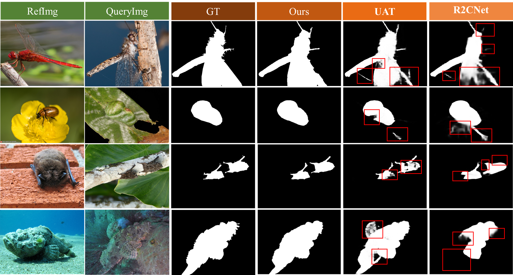
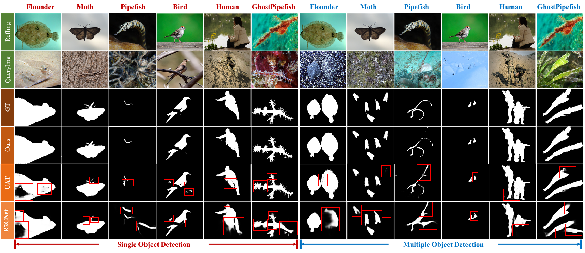
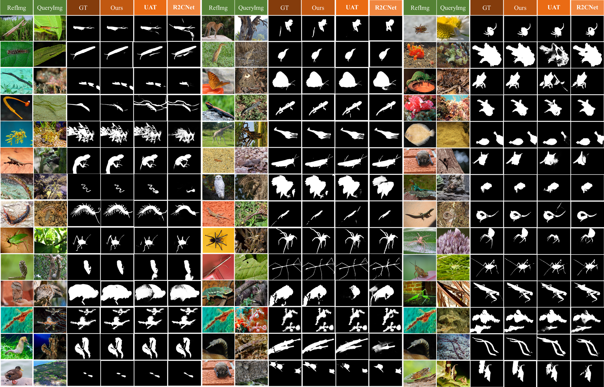

# **EviRCOD: Evidence-Guided Probabilistic Decoding for Referring Camouflaged Object Detection**

**EviRCOD** is designed to jointly realize four essential capabilities: reference-guided semantic transfer, deformable context aggregation, evidence-based uncertainty quantification, and boundary-aware refinement. These capabilities are instantiated in a unified end-to-end architecture comprising three key components:

1.  **Reference-Guided Deformable Encoder (RGDE)** couples hierarchical reference modulation with deformablenmulti-scale fusion, injecting semantic priors while adaptively aligning spatially variant tokens across resolutions.
2.  **Uncertainty-Aware Evidential Decoder (UAED)** incorporates Dirichlet-based evidence theory into hierarchical decoding to jointly model epistemic and aleatoric uncertainty, enabling robust confidence propagation and improved structural consistency.
3.  **Boundary-Aware Refinement Module (BARM)** integrates fine-grained edge cues with confidence-guided gating to selectively refine ambiguous regions, achieving precise boundary recovery.

The framework is optimized end-to-end via a joint hybrid loss that enforces structural fidelity, boundary sharpness, and well-calibrated uncertainty.

## **Visual Results**

The visual results below demonstrate the superior performance of EviRCOD compared to existing methods such as R2CNet [1] and UAT [2]. As stated in the paper, the proposed EviRCOD generates more complete segmentation structures, sharper boundaries, and fewer background misclassifications.

Visual Comparison 1：


Visual Comparison 2：


The following supplementary visualization further showcases the overall effectiveness of EviRCOD across diverse and challenging camouflage scenarios.

Visual Comparison 3：



## **Framework Architecture**

The overall pipeline of EviRCOD is illustrated below, detailing the interaction between the RGDE, UAED, and BARM modules within an end-to-end architecture.


## **Performance Summary**

Extensive experiments on the Ref-COD benchmark (R2C7K) demonstrate that EviRCOD establishes a new state-of-the-art. As shown in the paper, EviRCOD consistently outperforms existing methods such as R2CNet and UAT across multiple evaluation metrics. The following table highlights the quantitative comparison:

| Method           | Sₘ ↑ | ωF ↑ | αE ↑ | MAE ↓ |
|:---------------:|:----:|:----:|:----:|:-----:|
| R2CNet           | 0.805 | 0.669 | 0.879 | 0.036 |
| UAT              | 0.855 | 0.757 | 0.912 | 0.026 |
| **EviRCOD (Ours)** | **0.870** | **0.799** | **0.945** | **0.021** |

*Note: Higher values are better for Sₘ, ωF, and αE; lower values are better for MAE.*

The full model of EviRCOD achieves the best performance across all metrics, validating the effectiveness of the proposed framework.

## **Requirements**

- Python 3.9
- PyTorch 2.5.1
- CUDA 12.8
- TensorboardX 2.0
- opencv-python

```bash
pip install torch==2.5.1 torchvision torchaudio --index-url https://download.pytorch.org/whl/cu121
pip install tensorboardX opencv-python
```

## **Getting Started**

### 1. **Data Preparation**

Download the **R2C7K** dataset from [Baidu Netdisk](https://pan.baidu.com/s/1LHdqpD3w24fcLb_dbR6DyA) (access code: `2013`). Organize the dataset as follows:

```
R2C7K/
├── Camo/
│   ├── train/                # Training set (camo-subset, 64 categories)
│   └── test/                 # Testing set (camo-subset, 64 categories)
└── Ref/
    ├── Images/               # Reference images (ref-subset, 64 categories)
    ├── RefFeat_ICON-R/       # Pre-extracted object representations
    └── Saliency_ICON-R/      # Pre-extracted foreground maps
```

Update the `data_root` parameter in `train.py`, `infer.py`, and `test.py` with your dataset path.

### 2. **Training**

1. Download the pre-trained PVTv2 weights from [Baidu Netdisk](https://pan.baidu.com/s/1czmAayK9N5bW2HqrBDHWaw) (code: `EviR`).
2. Place the weights in your custom folder.
3. Run the training script:
```bash
python train.py
```

A pre-trained EviRCOD model is also available: [Baidu Netdisk](https://pan.baidu.com/s/1JyhKyvVuXqt7L1q2oJecjA) (code: `EviR`).

### 3. **Testing**

Evaluate the model performance on the test set:
```bash
python test.py
```

### 4. **Inference**

Generate prediction maps:
```bash
python infer.py
```

Pre-generated prediction maps are available: [Baidu Netdisk](https://pan.baidu.com/s/19Cn14K7JJVdETx2aIk7bbg) (code: `EviR`).

### 5. **REFERENCES**

[1]Xuying Zhang, Bowen Yin, Zheng Lin, Qibin Hou, Deng-Ping Fan, and Ming-Ming Cheng, “Referring camouflaged object detection,” IEEE Transactions on Pattern Analysis and Machine Intelligence, 2025.

[2]Ranwan Wu, Tian-Zhu Xiang, Guo-Sen Xie, Rongrong Gao, Xiangbo Shu, Fang Zhao, and Ling Shao, “Uncertainty-aware transformer for referring camouflaged object detection,” IEEE Transactions on Image Processing, 2025.